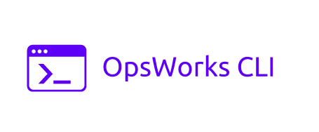

opsworks-cli
======================

A simple python module to work with aws opsworks.

[](https://travis-ci.org/chaturanga50/opsworks-cli) [](https://sonarcloud.io/dashboard?id=chaturanga50_opsworks-cli)
[](https://sonarcloud.io/component_measures/metric/coverage/list?id=chaturanga50_opsworks-cli)
[](https://sonarcloud.io/component_measures/metric/reliability_rating/list?id=chaturanga50_opsworks-cli)
[](https://sonarcloud.io/component_measures/metric/security_rating/list?id=chaturanga50_opsworks-cli) [](https://badge.fury.io/py/opsworks-cli) [](https://opensource.org/licenses/Apache-2.0)

How to install
--------------

You can download the updated release version from pypi repo using `pip` or directly from our github [releases](https://github.com/chaturanga50/opsworks-cli/releases) and `unzip` the content.

``` bash
pip install opsworks-cli
```

Usage
-----

You can see the list of parameters available via `opsworks-cli --help`

Options:

- [Update custom cookbook](#update-custom-cookbook) - Update all the cookbook cache in the instances in the layer.
- [Execute recipes](#execute-recipes) - Execute specific cookbook against layer.
- [Setup](#setup) - Running setup against layer.
- [Deploy](#deploy) - Deploy application to the layer.

update-custom-cookbook
----------------------

```bash
* region - OpsWorks stack region (required)
* stack - OpsWorks stack ID (required)
* layer - OpsWorks layer ID (required)
```

```bash
opsworks-cli update-custom-cookbooks --region eu-west-1 \
             --stack 2e7f6dd5-e4a3-4389-bc95-b4bacc234df0 \
             --layer ac0df176-104b-46ae-946e-7cf7367b816e
```

execute-recipes
---------------

```bash
* region - OpsWorks stack region (required)
* stack - OpsWorks stack ID (required)
* layer - OpsWorks layer ID (required)
* cookbook - chef cookbook (required)
* custom-json - custom json file with extra vars (optional)
```

```bash
opsworks-cli execute-recipes --region eu-west-1 \
             --stack 2e7f6dd5-e4a3-4389-bc95-b4bacc234df0 \
             --layer ac0df176-104b-46ae-946e-7cf7367b816e \
             --cookbook apache::default \
             --custom-json [{"lamp":{ "packages": { "app--sso": "17.1.6" } } }] # optional
```

```bash
opsworks-cli execute-recipes --region eu-west-1 \
             --stack 2e7f6dd5-e4a3-4389-bc95-b4bacc234df0 \
             --layer ac0df176-104b-46ae-946e-7cf7367b816e \
             --cookbook apache
```

setup
-----

```bash
* region - OpsWorks stack region (required)
* stack - OpsWorks stack ID (required)
* layer - OpsWorks layer ID (required)
```

```bash
opsworks-cli setup --region eu-west-1 \
             --stack 2e7f6dd5-e4a3-4389-bc95-b4bacc234df0 \
             --layer ac0df176-104b-46ae-946e-7cf7367b816e
```

deploy
------

```bash
* region - OpsWorks stack region (required)
* stack - OpsWorks stack ID (required)
* layer - OpsWorks layer ID (required)
```

```bash
opsworks-cli deploy --region eu-west-1 \
             --stack 2e7f6dd5-e4a3-4389-bc95-b4bacc234df0 \
             --layer ac0df176-104b-46ae-946e-7cf7367b816e
```

How it works
------------

- sending opsworks commands via aws api to specific stack ID and layer ID.
- according to the responces from servers `opsworks-cli` will show the final output.

Contributing
------------

Please read [CONTRIBUTING.md](CONTRIBUTING.md) for details on our code of conduct, and the process for submitting pull requests to us.

Authors
-------

- *Chathuranga Abeyrathna* - [github](https://github.com/chaturanga50/)

Contributors
------------

- *Iruka Rupasinghe* - [github](https://github.com/Rupasinghe2012/)

License
-------

opsworks-cli is licensed under the [Apache 2.0 License](LICENSE)
